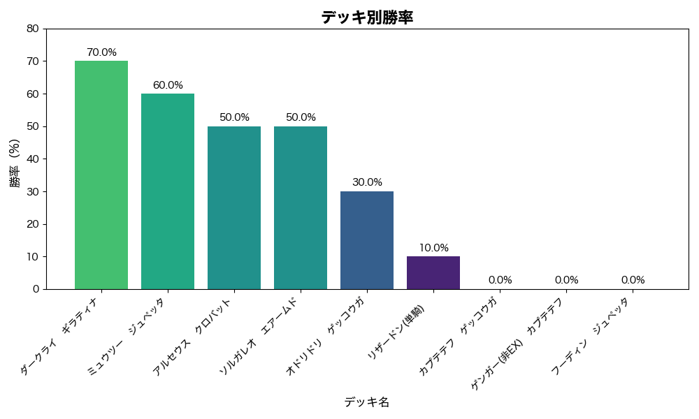
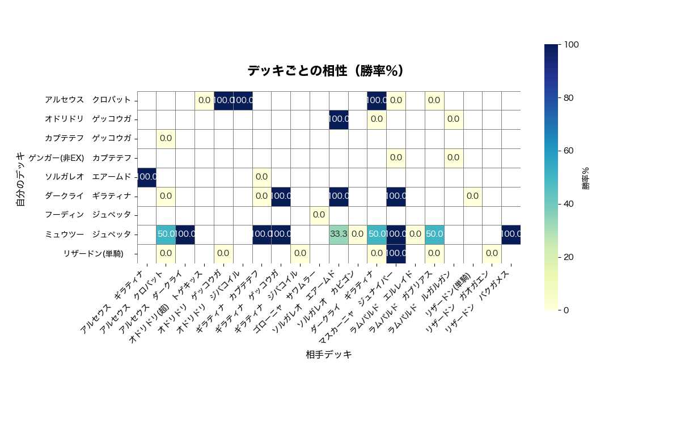

# ポケポケ対戦データ分析ツール
## 概要
本ツールは、スマホアプリ「ポケポケ」のランク戦における対戦データ（CSV形式）を解析し、ユーザーのデッキ使用傾向や対戦成績を視覚的に把握できるように設計されています。
分析結果は棒グラフやヒートマップで表示され、勝率の高いデッキの自動抽出も可能です。

## 主な機能
- 自分の使用デッキごとの勝率グラフ（棒グラフ）

- 使用デッキと対戦相手デッキの相性分析（ヒートマップ表示）

- 最も勝率の高いデッキの自動検出

- 入力CSVファイルを差し替えるだけで他のデータでも再分析可能

## 使用方法
1. ポケポケの対戦履歴データをCSV形式で用意し、pokepoke_battle_data.csv として保存してください。

2. 本プログラム（pokepoke_data.py）を実行します。

3. 分析結果のグラフや表が自動で表示されます。

## 今後のアップデート予定
- 分析結果をまとめた自動レポート生成機能の追加

- 先攻・後攻による勝率の影響分析

- 時系列データによるデッキ傾向の変化可視化

## 使用技術
- Python (pandas, matplotlib, seaborn) 

## 分析結果のサンプルイメージ

## 日本語フォントについて
- 利用環境（macOS / Windows / Linux）に応じて、自動で適切な日本語フォントが設定されます。
- 特別な設定は不要ですが、日本語フォントがインストールされていない環境ではグラフが正しく表示されないことがあります。

## テストの実行方法

このプロジェクトでは、`pytest` を使ってテストを行っています。

### 1. 仮想環境の作成（任意）

python -m venv venv
source venv/bin/activate # macOS/Linux
venv\Scripts\activate # Windows

### 2. 依存ライブラリのインストール

pip install pytest

もし他のライブラリもある場合は

pip install -r requirements.txt

でまとめてインストールしてください。

### 3. テストの実行

プロジェクトのルート（README.mdや`pokepoke_test.py`がある場所）で以下を実行します。

pytest

`pokepoke_test.py` のテストが自動で全部実行されます。

### 4. テスト結果の確認

成功するとこんな感じで表示されます。

============================= test session starts =============================
...
collected 3 items

pokepoke_test.py ... [100%]

============================== 3 passed in 0.03s ==============================

### 5. トラブルシューティング

- `pytest` が使えない場合は仮想環境がアクティベートされているか確認を。  
- テスト失敗時はエラー内容をよく読んでコードを見直してください。

### SQL版による分析
- Pythonによる分析のほかに、SQLを用いて対戦データの集計・勝率計算を行う簡易的なツール（sql_analysis.py）も作成しています。

- このツールは、対戦データをデータベースに取り込み、SQLクエリで以下のような集計を実現します。

使用デッキ別の対戦数、勝ち数、勝率の計算

集計結果のコンソール出力

- Pythonと比べると機能は限定的ですが、SQLでのデータ操作練習や他環境での簡単な集計に活用可能です。

